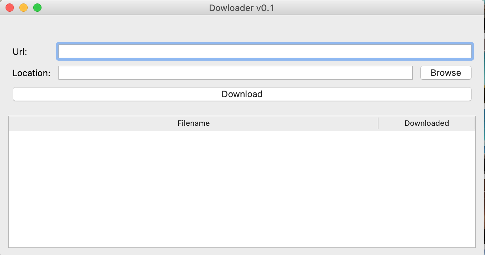
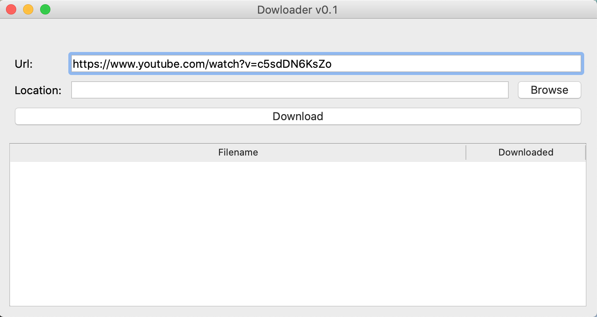

<h1>Media Downloader</h1>

 Media downloader is an app created with python to help download media files from the internet. 

<h2>Quick Start</h2>
To run this app, follow below steps
<ul>
 <li>Clone this repository : git clone https://github.com/ekmahama/mediaDownloader.git</li>
 <li>cd mediaDownloader </li>
 <li>pip install -r requirements.txt </li>
 <li>python myapp.py</li>
 <li> After the above command, awindow will pop up. tProvide url to media you want to download, select path to save the media </li> 
</ul>
<h2>Package dependencies</h2>
<ul>
 <li>PySide2==5.15.2</li>
 <li>shiboken2==5.15.2</li>
 <li>youtube-dl==2021.6.6</li>
</ul>
<h2>Screenshots</h2>

Step 1

Step 2

Step 3

Downloaded file

