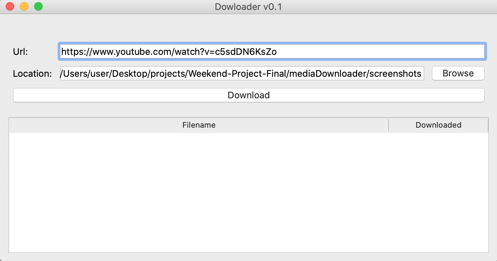

<h1>Media Downloader</h1>

 Media downloader is an app created with Python 3 to help download media files from youtube. The frontend of the is application was created with Qt framework, a free and open-source widget library for creating GUIs. To download a media file, you input the url of file of intereset, the application then downloads it for you.

<h2>Quick Start</h2>
To run this app, follow below steps
<ul>
 <li>Clone this repository : <pre> git clone https://github.com/ekmahama/mediaDownloader.git </pre></li>
 <li><pre>cd mediaDownloader </pre></li>
 <li><pre>pip install -r requirements.txt</pre> </li>
 <li><pre>python myapp.py</pre></li>
 <li> After the above command, a window will pop up. Provide url to media you want to download, select path to save the media </li> 
</ul>
<h2>Package dependencies</h2>
<ul>
 <li>PySide2==5.15.2</li>
 <li>shiboken2==5.15.2</li>
 <li>youtube-dl==2021.6.6</li>
</ul>
<h2>Screenshots</h2>

Step 1: Run my app as described in Qiuck start

Step 2: Provide path of media to download and select save location

Step 3: Click on the download button

Downloaded file

